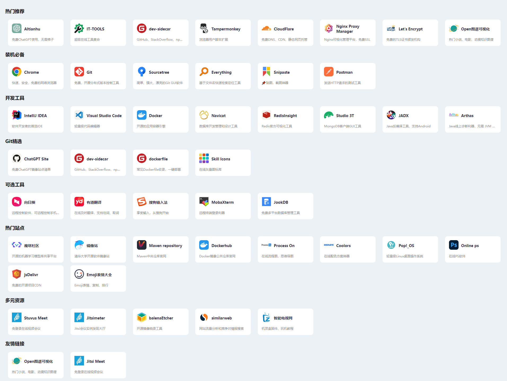
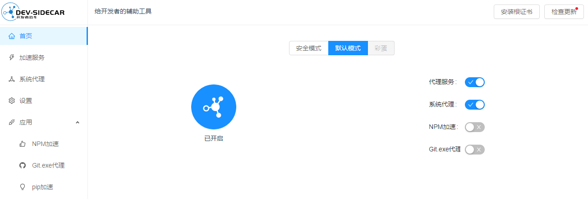
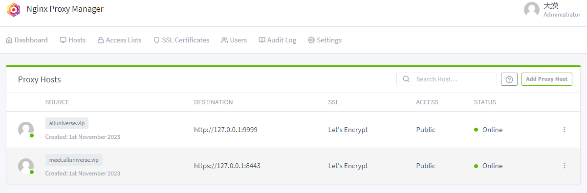

<h1 align="center" style="margin: 30px 0 30px; font-weight: bold;">
    探路者
</h1>
<h4 align="center">开发者导航 - Pro Developer网站导航</h4>
<p align="center">
    <a target="_blank" href="https://hello.alluniverse.vip">
        
    </a>
</p>

探路者是一款极简导航工具，致力于收录的每个站点都有其独特的作用。同时支持自定义[<u>导航</u>](./src/json/nav.json)，让用户快速实现个性化的导航站点。



## 特性概述

- [x] 免费ChatGPT
- [x] 装机必备
- [x] 开发工具
- [x] Git精选项目
- [x] 热门站点
- [ ] 工具破解
- [ ] 一键安装
- [ ] 经典教程
- [x] <a href="#部署">自托管</a>


### 免费ChatGPT

> 不定期更新**ChatGPT**的收录，保证服务免费可用

### IT-TOOLS

> 超级在线工具集合，支持搜索各种常用工具。文本对比、URL编解码、文本加解密、json格式化、YAML 格式转换等各种工具。


### dev-sidecar

> 支持GitHub、StackOverflow、npm加速、dns优选等



### Tampermonkey

> 浏览器用户脚本扩展，支持各种脚本；*全网VIP视频免费破解去广告、全网音乐直接下载、知乎增强、短视频无水印下载、百度网盘直接下载、OCS网课助手、网盘搜索引擎破解无限下载以及各种免费公开脚本*

### CloudFlare

>免费DNS、CDN、静态网页托管; *推荐**CloudFlare Pages**, 可白嫖网站，**推荐***

### Nginx Proxy Manager

>Nginx可视化管理平台，免费SSL; *支持不同域名代理一个服务器不同端口的服务，**推荐***



### Let's Encrypt

>免费的TLS证书颁发机构; *可以免费申请颁发、续签域名证书，**推荐***

### 装机必备

>*Git、Sourcetree、Everything、Snipaste、Postman等必备工具*

### 开发工具

>*IntelliJ IDEA、Visual Studio Code、Docker、Navicat、RedisInsight、Studio 3T*等开发工具


### Git精选

>ChatGPT Site，免费ChatGPT镜像站点清单
>dockerfile，常见Dockerfile收录，一键部署各种容器，***推荐***

### 可选工具

>向日葵，远程控制软件，***可手机远程控制***，远程桌面连接，远程开机
>有道翻译，在线及时翻译，支持***划词***、取词，支持浏览器、编辑器
>MobaXterm，远程终端登录利器，漂亮的UI


### 热门站点

>魔塔社区，开源的机器学习模型库共享平台
>清华大学开源软件镜像站，支持配置各种软件的镜像站点


## 部署
### GitHub Pages

1. [Fork](https://github.com/alluniverse-vip/alluniverse-vip.github.io/fork) 仓库
2. 自定义[nav.json](./src/json/nav.json)
3. 定义[个人令牌](./.github/workflows/deploy.yml#L24-L27)，参考[peaceiris/actions-gh-pages](https://github.com/peaceiris/actions-gh-pages#%EF%B8%8F-set-personal-access-token-personal_token)
4. 配置`GitHub Pages`，选择`Deploy from a branch`-`gh-pages`-`/ (root)`
   
### Cloudflare Pages

1. 创建账号，选择`Workers & Pages`
2. `Create application`-`Connect to Git`，关联选择仓库
3. Build command - `npm run build`，Build output directory - `dist`

### web服务器

```bash
# 安装依赖
npm ci
# 构建
npm run build
# copy dist
```
